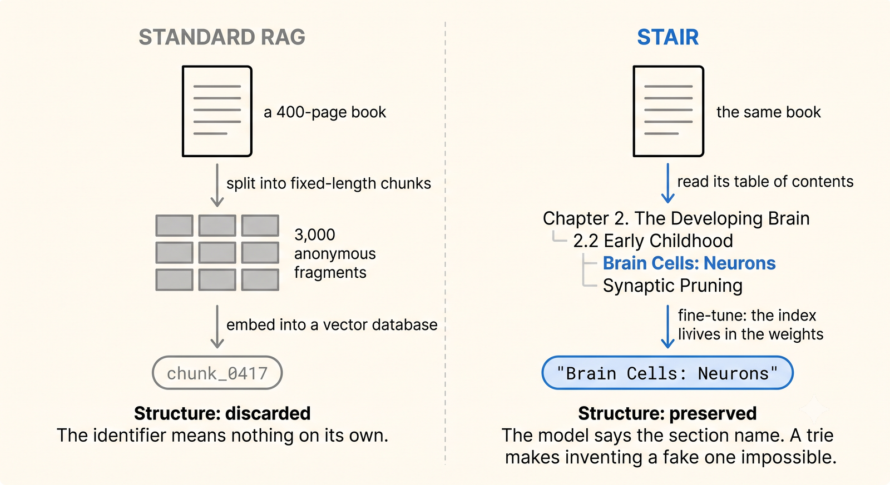
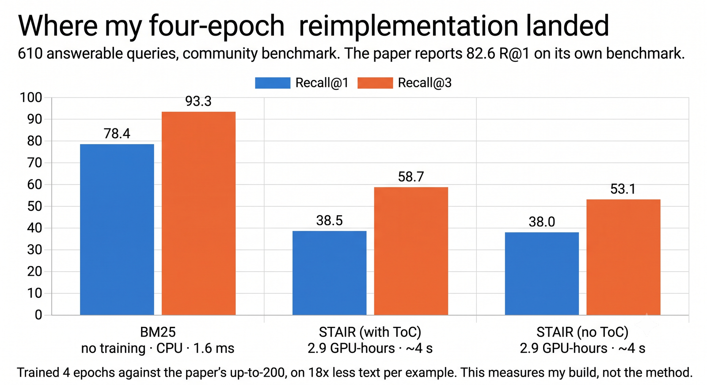
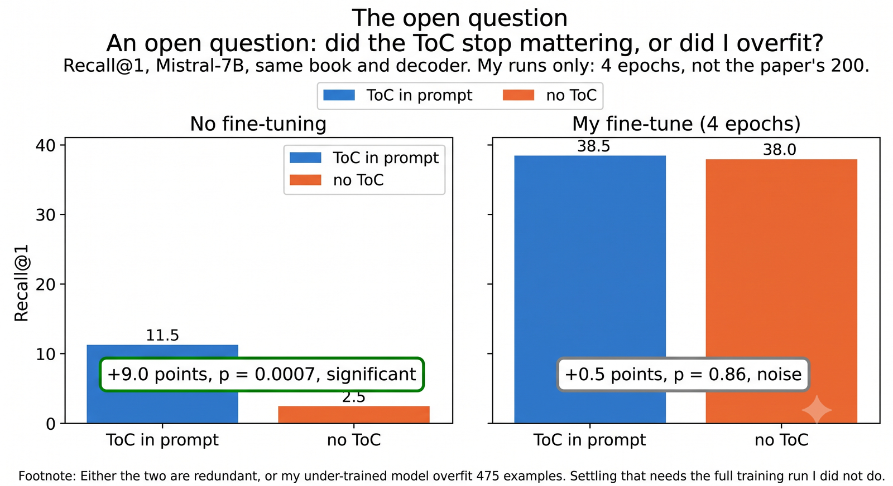

# STAIR: an open reimplementation

A from-scratch implementation of **STAIR (STructure Aware Information Retriever)**, a generative retrieval method that uses a document's **table of contents** as the document identifier instead of chunking the text.

Instead of returning `chunk_0417`, it returns `"Brain Cells: Neurons"`.


```
Q: "What are the building blocks of the nervous system?"
A: "Brain Cells: Neurons"
```

There is no vector database. The index lives in the model's weights, and a trie over the valid section titles makes it **structurally impossible** for the model to cite a section that does not exist. Hallucination rate was `0.00%` in every run measured here.

> **Why this repo exists.** The original paper's code and benchmark are published at an
> anonymous review URL that now returns `HTTP 410 Gone`. This is an independent
> reimplementation built from the paper text, so that anyone wanting to study or
> extend STAIR has something runnable.

## How it differs from chunk-based RAG



| | Classic RAG | STAIR |
|---|---|---|
| Where the index lives | a vector database | the model's weights |
| What comes back | an opaque chunk id | a real section title |
| Adding a document | one insert, milliseconds | retrain the model |

## Architecture


**Training** runs once per book. Task 1 (ingestion) memorises the corpus into the parameters. Task 2 (retrieval) teaches the model to address it from the table of contents. Both share one target, the section title, with loss masked to that span.

**Inference** is a single generate call whose output passes through the trie. That constraint is why the hallucination rate is zero rather than merely low.

---

**Paper:** [arXiv:2609.03874](https://arxiv.org/abs/2609.03874) by Vineet Kumar, Meghanadh Pulivarthi, Vishwajeet Kumar, Jaydeep Sen, Riyaz Ahmad Bhat and Sachindra Joshi, IBM Research. The method is theirs. Any shortfall in this implementation is mine.

---

## Results

One book (`whole-child`), 610 answerable test queries, Mistral-7B + LoRA, **4 epochs**.



| System | R@1 | R@3 | nDCG@3 | Hallucination |
|---|---|---|---|---|
| BM25 | 78.36 | 93.28 | 87.30 | 0.00% |
| This impl. (ToC) | 38.52 | 58.69 | 50.22 | 0.00% |
| This impl. (no ToC) | 38.03 | 53.11 | 46.69 | 0.00% |

**These are not comparable to the paper's 82.6% R@1.** Different benchmark, one book instead of eighteen, and four epochs against the paper's allowance of up to 200. Read them as a working baseline for this codebase, not as an evaluation of the method.

Paired randomization test, the paper's own significance method:

| Comparison | R@1 | p | R@3 | p |
|---|---|---|---|---|
| ToC vs no-ToC (0.5B) | −0.98 | 0.63 | +4.75 | **0.015** |
| ToC vs no-ToC (7B) | +0.49 | 0.86 | +5.57 | **0.0025** |

The table of contents gives a significant gain at R@3 and none at R@1, replicated across a 14x change in model size.



Without fine-tuning the ToC is worth 4.6x; with it, nothing measurable at R@1. Either the two are redundant, or this undertrained model overfit its 475 examples. Settling that needs the full training run.

## Hardware

Mistral-7B-Instruct-v0.2 with 4-bit QLoRA fits in **5.01 GB of VRAM** at ~1,100-token examples, so this runs on a consumer 8 GB card.

```
weights (4-bit)      : 3.85 GB
peak, fwd+bwd @1111  : 5.01 GB
LoRA trainable       : 41.9M params (1.1%)
throughput           : 4.0 s/example
```

The binding constraint is the number of section titles the model must memorise, not the context length. Every benchmark book has a table of contents under 3,100 tokens, well inside the paper's 14,000-token budget.

---

## Install

Python 3.11. Two environments on purpose: a GPU one for training, a CPU one for corpus work, so a long install never blocks analysis.

```bash
python -m venv .venv
.venv/Scripts/python.exe -m pip install torch==2.9.1+cu128 \
    --extra-index-url https://download.pytorch.org/whl/cu128
.venv/Scripts/python.exe -m pip install -r requirements.txt
```

> **On Windows:** always use `.venv\Scripts\python.exe -m pip`, never `pip.exe`
> directly. The launcher deadlocks when pip tries to replace itself. Verify an
> install by importing the package, not by the exit code.

Pick the torch build that matches your GPU. `cu128` and torch >= 2.7 are required for Blackwell (`sm_120`).

## Quick start

```bash
# 1. Parse PDFs into per-book corpora (ToC tree, leaf sections, text)
python scripts/build_corpus.py books/ data/corpora

# 2. Inspect what you got: leaf counts, ToC depth, token budget
python scripts/audit_books.py books/

# 3. Train, with the table of contents in the prompt
python scripts/train_stair.py --book whole-child \
    --model mistralai/Mistral-7B-Instruct-v0.2 --four-bit --epochs 4

# 4. Train the ablation: identical, minus the ToC
python scripts/train_stair.py --book whole-child --no-toc \
    --model mistralai/Mistral-7B-Instruct-v0.2 --four-bit --epochs 4

# 5. Evaluate both against BM25, with significance testing
python scripts/evaluate_run.py --book whole-child \
    --model mistralai/Mistral-7B-Instruct-v0.2
```

Training logs stream to `logs/<book>-<variant>-<model>.log`, flushed per line, with one JSON row per epoch alongside.

## Layout

```
src/stair/
  toc.py            ToC tree, leaf detection, page spans
  corpus.py         PDF -> leaf sections, front-matter filter, docid disambiguation
  prompts.py        prompt construction + context-budget fitting
  constrained.py    token trie, prefix_allowed_tokens_fn
  model.py          the retriever: generate a section title, constrained
  train.py          two-task LoRA training, loss masked to target
  baselines.py      BM25
  evaluate.py       R@1, R@3, nDCG@3, hallucination rate
  significance.py   paired randomization test
  data.py           benchmark loading, normalised to one shape
  querygen.py       synthetic query generation (local model or API)

scripts/
  build_corpus.py   PDFs -> corpora, with a filtering report
  audit_books.py    per-book ToC token census
  train_stair.py    training entry point, resumable
  evaluate_run.py   test-set eval with significance
  zeroshot_test.py  untrained baseline: is the fine-tuning necessary?
  sweep.py          multi-book sweep, resumable per cell
  generate_queries.py, fetch_model.py, show_env.py
```

## Design notes

**The docid must be semantic.** STAIR's identifier is the leaf section *title*. Using a numeric id instead rebuilds the plain DSI baseline that STAIR is meant to beat, and nothing about the run looks wrong when you do, because every metric still computes.

**Titles are not unique.** "Summary" and "Conclusion" recur once per chapter, 9 to 15 times per book in our corpora. `corpus.py` falls back to the full hierarchical path only where a bare title collides, which is the smallest deviation that makes the identifier actually identify.

**Front matter parses as retrievable.** "Cover", "Copyright" and "Table of Contents" arrive as leaf sections with real page spans. Filtered by default, with the count reported.

**Never quote a gap without a p-value.** A 5-point difference on a 60-query dev set here turned out to be three questions at `p = 0.25`. `significance.py` exists for exactly this.

## Benchmark caveat

The only obtainable benchmark is a community rebuild ([`SGK86/searchtome-subset`](https://huggingface.co/datasets/SGK86/searchtome-subset)), and **up to 21.8% of its test queries have gold sections missing from the corpus**, varying per book:

| Book | Test queries | Unanswerable |
|---|---|---|
| compgov | 623 | 21.8% |
| whole-child | 689 | 11.5% |
| auralskills | 1,067 | 8.2% |
| openmusictheory | 3,417 | 5.1% |
| behavioralecon | 1,254 | 1.7% |
| digitalage | 2,301 | 0.9% |

These cap every system's ceiling unevenly. `evaluate_run.py` reports answerable-only figures and states the orphan rate. Before this was caught, `compgov` looked like the hardest book by a wide margin; on answerable queries it is mid-pack.

## Tests

```bash
python -m pytest tests/ -q
```

Covers the pure logic: ToC tree construction and span assignment, trie traversal and dead ends, metric correctness, and the randomization test against known cases.

## Known limitations

- **One book evaluated.** The ToC findings need a second book and domain to be solid.
- **Four epochs, not 200.** R@3 was still climbing when training stopped.
- **Retraining on corpus change.** The index is the weights, so adding a document means training again. This is inherent to DSI, and it is the main reason to prefer a vector store for anything that changes.

## License

MIT. See [LICENSE](LICENSE).

The STAIR method belongs to its authors; this is an independent implementation. Source books are not distributed with this repository.
